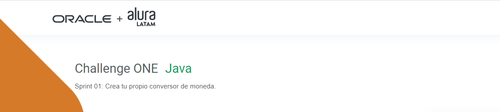
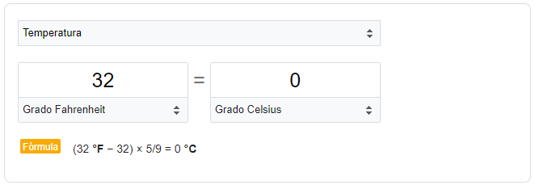
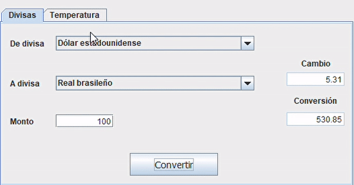

 
   
   
   

---

## Descripción
#### El objetivo de este quinto challenge es poner en práctica los conceptos aprendidos sobre Java en la ruta Back-End del programa **ONE**.
---
&nbsp;

## Funcionalidad
  
 El proyecto consiste en una aplicación de escritorio con las funcionalidades de conversión de divisas y temperaturas.
 La interface gráfica está basada en la biblioteca Swing y se contruyo en Eclipse con el plugins WindowBuilder.

 - El conversor de divisas consume la API Fixer.io para realizar su trabajo.

&nbsp;

&nbsp;
- Para la parte de temperaturas, se duplicó el comportamiento del conversor de Google.

&nbsp;
   

&nbsp;

#### Marca este proyecto con una estrella ⭐

&nbsp;

---
## Tecnologías utilizadas

---
## Autor
[ Claudio Bressan](https://github.com/Claubress) |
 :---: |

